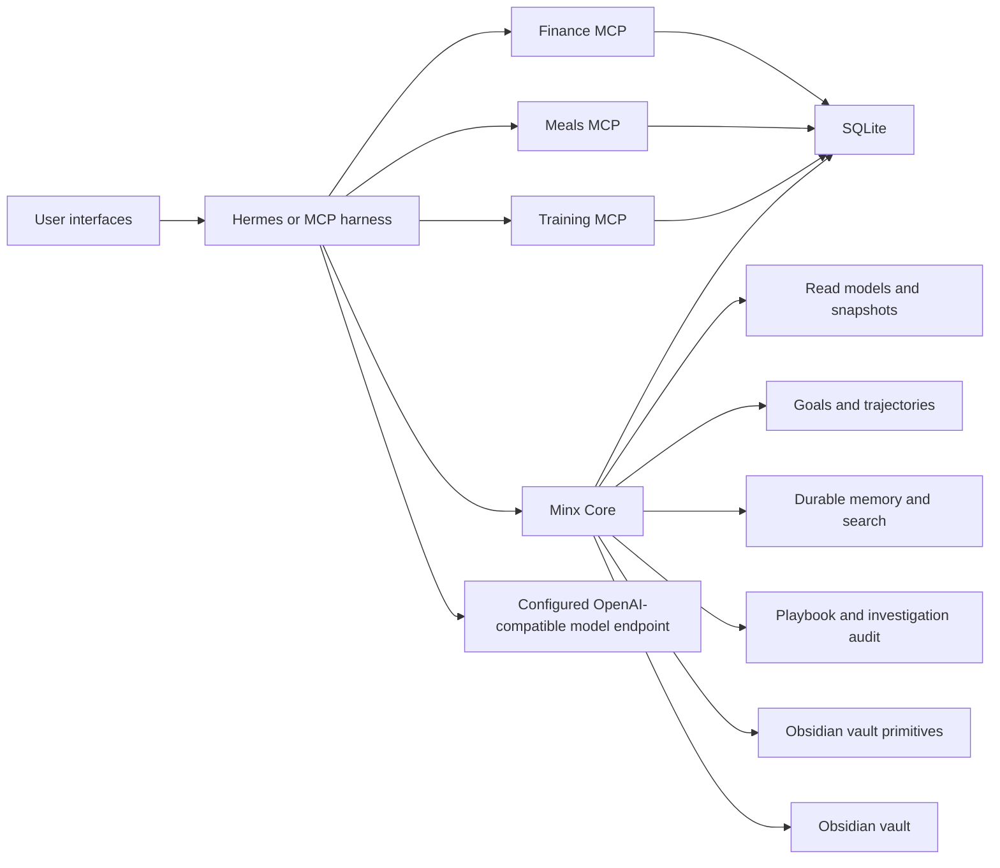

# Minx MCP

Minx is a local-first personal operating system built as a set of Model Context Protocol servers. It turns finance, meals, training, goals, memory, and Obsidian notes into structured context that an MCP-capable harness can use for coaching, planning, retrospectives, and investigations.

The project is deliberately split between durable systems and conversational systems:

- **Domain MCPs** own facts and deterministic business logic.
- **Minx Core** owns cross-domain interpretation, memory, read models, vault primitives, render contracts, and audit trails.
- **Hermes or another harness** owns dialogue, scheduling, model calls, tool choice, and final prose.

The database knows what happened. The harness decides how to talk about it.

## Where to start

| You are... | Read |
|---|---|
| Setting it up for the first time | [docs/RUNBOOK.md](docs/RUNBOOK.md) |
| Understanding the architecture | [docs/ARCHITECTURE.md](docs/ARCHITECTURE.md) |
| An agent (Claude / Codex / Hermes) about to work in this repo | [docs/AGENT_GUIDE.md](docs/AGENT_GUIDE.md) |
| Looking up what's implemented | [STATUS.md](STATUS.md) |
| Looking up env vars / paths / maintenance commands | [OPERATIONS.md](OPERATIONS.md) |
| Mid-session handing off to the next session | [HANDOFF.md](HANDOFF.md) |

## What it does

Minx ships four MCP servers:

| Server | Responsibility |
|---|---|
| `minx-finance` | Personal finance imports, categorization, reports, and read APIs |
| `minx-meals` | Meal, pantry, recipe, and nutrition state |
| `minx-training` | Training logs and progression state |
| `minx-core` | Cross-domain interpretation, memory, snapshots, goals, vault sync, playbook + investigation audit |

The harness-side integration lives in [minx-hermes](https://github.com/akminx/minx-hermes). Its `hermes_loop/runtime.py` drives budgeted, tool-allowlisted investigations against these four MCP servers and records digest-only audit rows back into Core.

## Architecture



Core exposes structured facts and render hints, not final coaching prose. That keeps the system inspectable, testable, and resilient when the model layer changes.

## 60-second quick start

```bash
git clone https://github.com/akminx/minx minx
cd minx
uv sync --all-extras
uv run pytest tests/ -q

export OPENROUTER_API_KEY=sk-or-v1-...
export MINX_OPENROUTER_API_KEY=$OPENROUTER_API_KEY
uv run scripts/configure-openrouter.py --model google/gemini-2.5-flash
./scripts/start_hermes_stack.sh                  # MCP servers on 8000-8003
```

Then drive an investigation (from the [minx-hermes](https://github.com/akminx/minx-hermes) checkout):

```bash
export MINX_INVESTIGATION_MODEL=google/gemini-2.5-flash
uv run scripts/minx-investigate.py --kind investigate \
  --question "what merchants did I spend the most at last month?" \
  --max-tool-calls 6 --wall-clock-s 60
```

For everything else — real-data smokes, troubleshooting, observability — see [docs/RUNBOOK.md](docs/RUNBOOK.md).

## Repo layout

```
minx_mcp/
  core/        Cross-domain interpretation, memory, goals, vault sync, audits, render templates
  finance/     Finance import / read / report tools
  meals/       Meal, pantry, recipe, nutrition tools
  training/    Workout and progression tools
  schema/      Packaged SQLite migrations (single source of truth)
scripts/       Setup, maintenance, smoke helpers
tests/         Regression coverage for domain services, migrations, MCP tools, transports, and safety edges
docs/
  RUNBOOK.md   How to run end to end
  AGENT_GUIDE.md How agents should think about this repo
  ARCHITECTURE.md Current architecture narrative
  superpowers/specs/   Dated design records and implementation specs
  archive/     Historical handoffs
```

Dated specs and plans are useful evidence of the build process, but current behavior is summarized in `README.md`, `docs/ARCHITECTURE.md`, `STATUS.md`, `OPERATIONS.md`, and `docs/RUNBOOK.md`.

## Engineering patterns worth borrowing

- Local-first SQLite with explicit, versioned migrations.
- Hard domain boundaries between finance, meals, training, and core interpretation.
- MCP tool contracts that always return structured success/error envelopes.
- Append-only render template registry that prevents Core ↔ harness drift.
- Digest-only audit trails for autonomous workflows (no raw tool output stored).
- Money as integer cents, never floats.
- Secret scanning before any memory / vault / embedding write.
- Test-driven hardening of concurrency, lifecycle, and validation edge cases.

## Limitations

- Local single-user tool. No auth, multi-user isolation, or remote durability.
- SQLite + filesystem writes are recoverable but not globally atomic across resources.
- LLM-backed features degrade to deterministic local behavior when no provider is configured.
- Hermes-side agent loops live in the [minx-hermes](https://github.com/akminx/minx-hermes) repo. Core only stores their durable surfaces.
