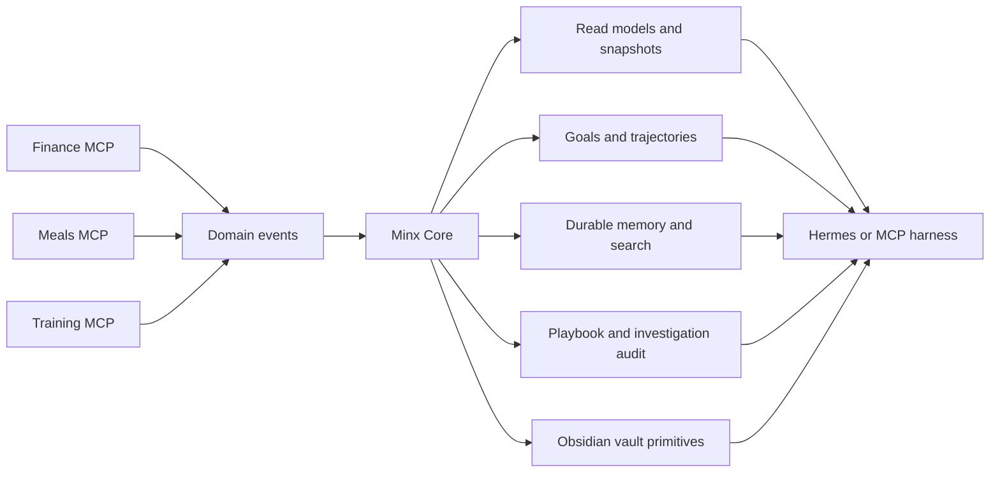

# Minx MCP

Minx MCP is a local-first personal Life OS built as a set of Model Context Protocol servers. It turns everyday personal data into structured, auditable context that an MCP-capable harness can use for coaching, reflection, planning, and investigation.

The project is intentionally split between durable systems and conversational systems:

- Domain MCPs own facts and deterministic domain operations.
- Minx Core owns interpretation, memory, read models, detectors, and audit trails.
- Hermes or another harness owns dialogue, scheduling, LLM prose, and agent loops.

That boundary is the heart of the system. The database should know what happened. The harness should decide how to talk about it.

## What It Does

Minx currently ships four MCP servers:

| Server | Responsibility | Examples |
| --- | --- | --- |
| `minx-finance` | Personal finance imports, categorization, reports, and read APIs | CSV/PDF imports, merchant/category filters, weekly/monthly reports |
| `minx-meals` | Meal, pantry, recipe, and nutrition state | Meal logging, pantry items, recipe vault sync, nutrition summaries |
| `minx-training` | Training logs and progression state | Workout entries, progression signals, training read models |
| `minx-core` | Cross-domain interpretation and memory | Daily snapshots, goals, durable memory, vault sync, playbook and investigation audit |

The current implementation supports local SQLite durability, Obsidian-style vault integration, secret-gated memory/vault writes, FTS5 memory search, optional OpenRouter-backed embedding rerank, and digest-only investigation history.

## Architecture



Core exposes structured facts, not final coaching prose. That makes the system inspectable, testable, and resilient when the LLM layer changes.

## Why This Project Matters

This codebase demonstrates several engineering patterns that matter beyond the personal-data domain:

- Local-first architecture with SQLite migrations and explicit upgrade paths.
- Clear domain boundaries between finance, meals, training, and core interpretation.
- MCP tool contracts that return structured success/error envelopes.
- Durable audit trails for autonomous or semi-autonomous workflows.
- Careful handling of money as integer cents.
- Secret scanning before memory, vault, or embedding surfaces persist sensitive-looking data.
- Test-driven hardening of concurrency, lifecycle, import, and validation edge cases.

## Repository Guide

```text
minx_mcp/
  core/       Cross-domain interpretation, memory, goals, vault sync, audits
  finance/    Finance import/read/report tools
  meals/      Meal, pantry, recipe, and nutrition tools
  training/   Workout and progression tools
  schema/     Packaged SQLite migrations
scripts/      Maintenance and smoke-test helpers
tests/        Unit, integration, transport, and regression coverage
docs/         Architecture specs, implementation plans, and archives
```

Start with:

- [STATUS.md](STATUS.md) for the current implementation state and next work.
- [OPERATIONS.md](OPERATIONS.md) for setup, commands, configuration, and maintenance.
- [docs/archive/handoff-history.md](docs/archive/handoff-history.md) for the historical slice log.

## Quick Start

```bash
python3 -m venv .venv
.venv/bin/pip install -e '.[dev]'
uv run pytest tests/ -x -q
```

Run a server over stdio:

```bash
uv run python -m minx_mcp.core --transport stdio
```

Run the full local HTTP stack:

```bash
./scripts/start_hermes_stack.sh
```

Default HTTP ports:

| Server | Port |
| --- | --- |
| Finance | `8000` |
| Core | `8001` |
| Meals | `8002` |
| Training | `8003` |

## Verification

```bash
uv run ruff check minx_mcp tests scripts
uv run mypy minx_mcp
uv run pytest tests/ -x -q
```

The project currently uses strict mypy for source files and broad pytest coverage across domain services, SQLite migrations, MCP tools, transport smoke tests, and historical bug regressions.

## Current Limitations

- This is a local single-user tool. It does not provide auth, multi-user isolation, or remote durability.
- SQLite and filesystem writes are carefully handled, but cross-resource operations cannot be globally atomic.
- LLM-backed features are optional and must degrade to deterministic local behavior when unavailable.
- Hermes-side agent loops live outside this repository; Core only stores the durable surfaces they use.

## More Documentation

- [Operations](OPERATIONS.md)
- [Current status](STATUS.md)
- [Architecture design](docs/superpowers/specs/2026-04-06-minx-life-os-architecture-design.md)
- [Slice roadmap](docs/superpowers/specs/2026-04-06-minx-roadmap-slices.md)
- [Historical handoff archive](docs/archive/handoff-history.md)
