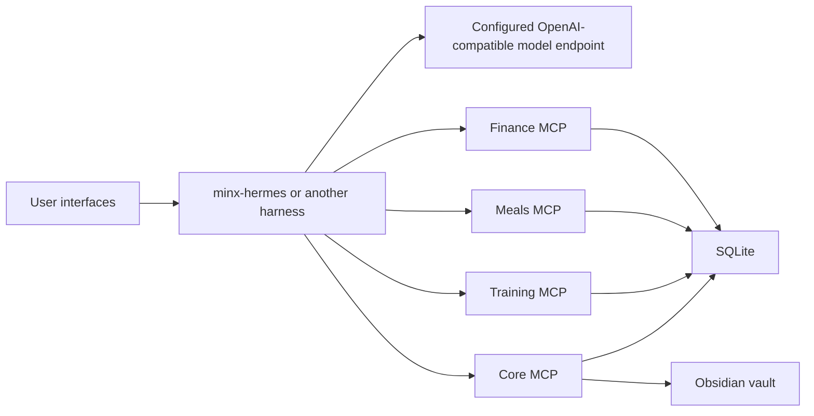

# Minx Architecture

Minx is a local-first personal operating system built around four MCP servers and a separate agentic harness. The boundary is the core design choice: durable data and deterministic domain logic stay in `minx`; conversation, scheduling, tool choice, and final prose stay in `minx-hermes` or another MCP harness.

## System Map

The harness can ask questions, choose read tools, and compose the answer. The MCP servers own the records and return structured data. Core also stores the audit trail for playbooks and investigations, so runs remain inspectable after the model turn is gone.

## Repositories

| Repo | Owns |
|---|---|
| `minx` | MCP servers, SQLite schema, domain services, Core read models, memory, goals, vault primitives, render templates, playbook and investigation audit storage |
| `minx-hermes` | Hermes skills, Discord lane guidance, investigation runner, tool-call policy, MCP client fan-out, hard budgets, and smoke scripts |
| Hermes upstream/runtime | Harness process, user interface, slash command runtime, cron scheduler, and live config |

## MCP Servers

| Server | Default HTTP port | Responsibility |
|---|---:|---|
| Finance | 8000 | Statement imports, categorization, money arithmetic, reports, and finance read APIs |
| Core | 8001 | Snapshots, goals, durable memory, vault primitives, render contracts, playbooks, and investigations |
| Meals | 8002 | Pantry, recipes, meals, and nutrition profiles |
| Training | 8003 | Exercise catalog, sessions, programs, and progress summaries |

Each server can run over stdio for local MCP clients or HTTP for the Hermes stack. `scripts/start_hermes_stack.sh` starts the four HTTP servers together.

## Data Flow

1. Domain tools write structured rows to SQLite and project selected records into the vault when appropriate.
2. Core builds cross-domain read models from finance, meals, training, goals, and memory.
3. Hermes or another harness asks questions and calls read tools through MCP.
4. Investigation runs append digest-only steps to Core: tool name, argument digest, result digest, latency, and small render slots.
5. Hermes writes the final user-facing answer; Core stores durable facts, citations, lifecycle state, and render hints.

## Render Boundary

Core returns `response_template` and `response_slots` for user-visible events, but it does not own final prose. That makes templates stable contracts instead of hidden strings scattered through domain logic. If a response needs new wording semantics, add a new template id in `minx_mcp/core/render_templates.py` rather than changing an existing id's meaning.

## Model Boundary

Minx does not hard-code an architecture-level model. The harness uses an OpenAI-compatible chat endpoint, commonly via OpenRouter, and the model id is deployment configuration. Setup examples use `google/gemini-2.5-flash` as the recommended OpenRouter model because it is a practical default for fast tool-calling investigations, but any compatible model can be configured and tested.

Embeddings are optional. When `MINX_OPENROUTER_API_KEY` is configured, Core can enqueue and process memory embeddings through `OpenRouterEmbedder`; otherwise memory search falls back to deterministic FTS5.

## Safety And Reliability

- SQLite migrations are packaged and applied on first connection.
- Money is stored as integer cents.
- Finance imports are constrained to the staging root.
- Memory capture defaults to candidate status before confirmation.
- Secret-shaped values are blocked or redacted before memory, vault, or embedding writes.
- Investigation steps store digests and small summaries, not raw tool outputs or transcripts.
- Hard tool-call and wall-clock budgets live in the harness; Core enforces a high soft cap as defense in depth.
- The system is local and single-user by design. It does not claim multi-tenant auth, cloud durability, or remote access isolation.

## Current Truth Versus Design Records

Current behavior is documented in:

- `README.md`
- `docs/ARCHITECTURE.md`
- `STATUS.md`
- `OPERATIONS.md`
- `docs/RUNBOOK.md`
- `docs/AGENT_GUIDE.md`
- `HANDOFF.md` for short-lived session notes only

Dated files under `docs/superpowers/specs/` and `docs/superpowers/plans/` are design records. They are valuable for understanding how the project was built, but they are not automatically authoritative if they conflict with the current docs or code.
