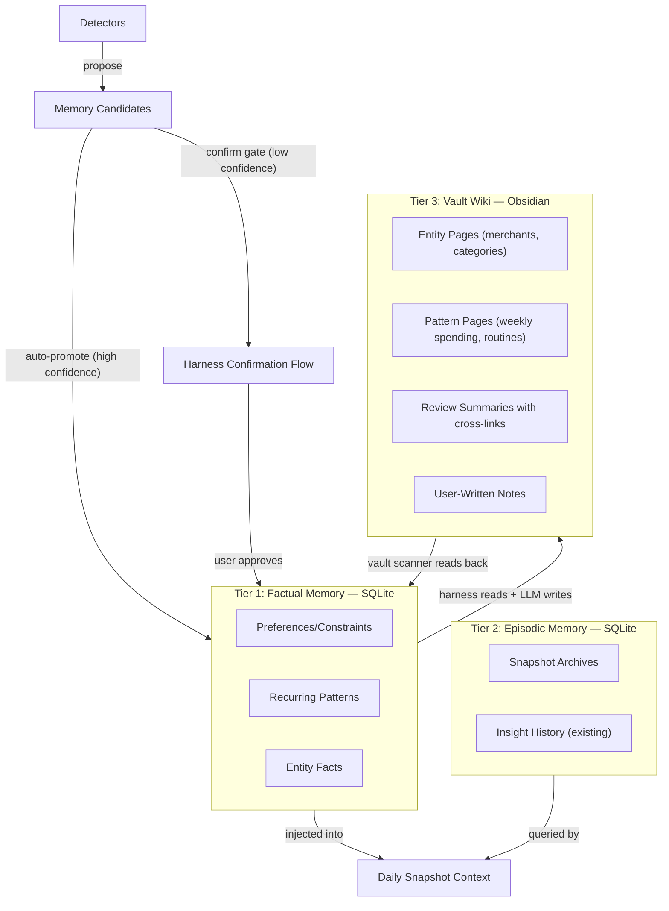
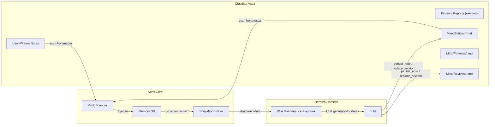
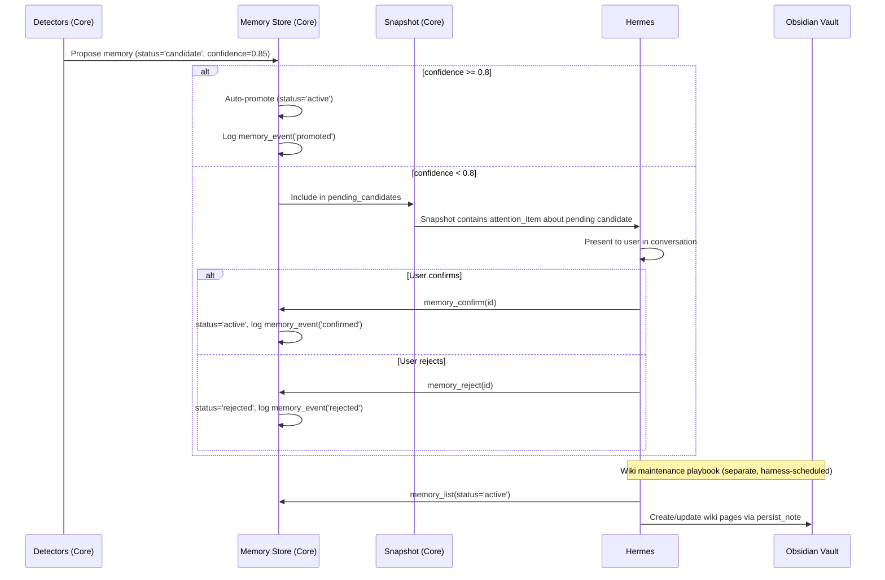
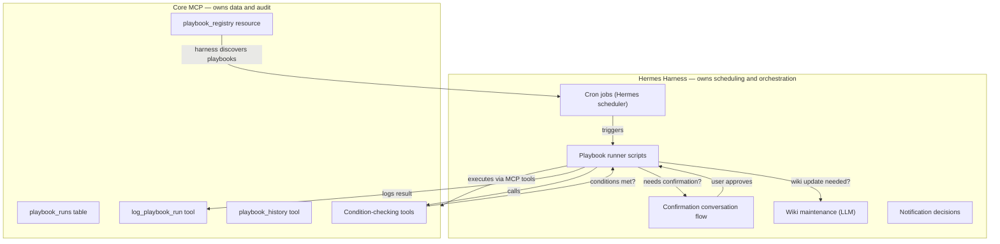

# Slice 6 and Slice 8: Memory + Autonomy Design

## Context

Minx currently has no memory between sessions (every snapshot starts from scratch) and no ability to act without being asked. Slice 6 gives Minx a brain; Slice 8 gives it initiative. They must be designed together because autonomy without memory is dangerous, and memory without any autonomous use is just a database.

### Existing Infrastructure

- **SQLite** for all persistent state (12 migrations, well-tested)
- **Obsidian vault** for human-readable artifacts (`VaultWriter` with `write_markdown` and `replace_section`, `persist_note` tool, finance reports)
- **Event system** for cross-domain integration
- **Detector framework** for pattern recognition
- **Job system** for async work tracking
- **LLM integration** (OpenAI-compatible) for interpretation
- **Hermes harness** with its own cron/jobs system for scheduling

### Architecture Principle

**Domains own facts. Core owns interpretation. Harnesses own conversation, rendering, and scheduling.**

This principle, established in Slice 2.5, governs how memory and autonomy are split. Core provides structured data, memory storage, and audit trails. The harness (Hermes) owns when to act, how to present information, and how to maintain the vault wiki.

---

## Slice 6: Durable Memory

### Design Philosophy

Memory should be **queryable, explainable, and auditable**. Every memory should answer: what do I know, why do I know it, and when did I learn it. This rules out opaque vector-only stores.

Inspired by Karpathy's **LLM Wiki** pattern: "Obsidian is the IDE; the LLM is the programmer; the wiki is the codebase." Instead of re-deriving knowledge on every query (RAG), Minx incrementally builds and maintains a persistent, structured wiki in the Obsidian vault alongside a machine-queryable SQLite memory layer.

### Three-Tier Memory Architecture



---

### Tier 1: Factual Memory (structured, SQLite)

Things Minx "knows" as established facts. Small, queryable, directly injected into every snapshot context.

- User preferences and constraints ("I'm vegetarian", "payday is the 15th", "restaurant budget is $200/week")
- Recurring patterns ("coffee at Starbucks every Monday", "gym on Tue/Thu/Sat")
- Entity knowledge ("Whole Foods is a grocery store", "Joe's Cafe is a restaurant near work")

**Schema:**

```sql
CREATE TABLE memories (
    id INTEGER PRIMARY KEY,
    domain TEXT NOT NULL,            -- 'finance', 'meals', 'training', 'core'
    memory_type TEXT NOT NULL,       -- 'preference', 'pattern', 'entity_fact', 'constraint'
    key TEXT NOT NULL,               -- namespaced: 'finance.merchant_category.starbucks'
    value_json TEXT NOT NULL,        -- structured payload
    confidence REAL NOT NULL DEFAULT 1.0,
    source TEXT NOT NULL,            -- 'user', 'detector', 'vault_sync'
    source_ref TEXT,                 -- detector name, conversation ref, vault path
    status TEXT NOT NULL DEFAULT 'active',  -- 'active', 'candidate', 'expired', 'rejected'
    created_at TEXT NOT NULL DEFAULT (datetime('now')),
    updated_at TEXT NOT NULL DEFAULT (datetime('now')),
    expires_at TEXT,
    UNIQUE(domain, key)
);

CREATE TABLE memory_events (
    id INTEGER PRIMARY KEY,
    memory_id INTEGER NOT NULL REFERENCES memories(id),
    event_type TEXT NOT NULL,        -- 'created', 'promoted', 'confirmed', 'rejected', 'expired', 'updated', 'vault_synced'
    detail_json TEXT,
    created_at TEXT NOT NULL DEFAULT (datetime('now'))
);
```

**MCP Tools** (Core server):

- `memory_list(domain?, memory_type?, status?)` — browse memories with filters
- `memory_get(memory_id)` — single memory with its event history
- `memory_create(domain, memory_type, key, value_json, source?)` — manual creation (Hermes records user-stated preferences)
- `memory_confirm(memory_id)` — promote a candidate to active
- `memory_reject(memory_id)` — reject a candidate
- `memory_expire(memory_id)` — manually expire
- `get_pending_memory_candidates(domain?)` — candidates awaiting confirmation (used by harness)

**Memory-Proposing Detectors** (new, in Core):

- `detect_recurring_merchant_pattern`: Merchant appears 4+ times in 30 days with similar amounts -> propose pattern memory
- `detect_category_preference`: User always categorizes a merchant the same way -> propose entity fact
- `detect_schedule_pattern`: Workouts/meals follow a weekly pattern -> propose schedule memory

---

### Tier 2: Episodic Memory (structured, SQLite)

Records of what happened and what Minx saw. The existing `insights` table already covers detector output history. Add snapshot persistence for reproducibility.

**Schema addition:**

```sql
CREATE TABLE snapshot_archives (
    id INTEGER PRIMARY KEY,
    review_date TEXT NOT NULL UNIQUE,
    snapshot_json TEXT NOT NULL,     -- DailySnapshot as JSON
    created_at TEXT NOT NULL DEFAULT (datetime('now'))
);
```

The existing `insights` table + `get_insight_history` tool covers historical signal retrieval. No changes needed.

**Integration:** After `build_daily_snapshot` completes, auto-persist the snapshot to `snapshot_archives`. This happens in Core — no harness involvement.

---

### Tier 3: Vault Wiki (semi-structured, Obsidian — LLM Wiki pattern)

This is where Obsidian becomes a first-class knowledge surface. The vault is both a **read source** (Minx scans it for user-written notes and corrections) and a **write target** (Minx maintains structured wiki pages).



**Key insight: Wiki maintenance is a harness responsibility.** Core provides the data (snapshots, memories, detector output). The harness (Hermes) uses the LLM to generate and update wiki pages via Core's `persist_note` tool and `VaultWriter.replace_section`. This keeps LLM-generated prose out of Core.

**Vault reading (Core):**

- Extend the meals recipe scanning pattern to a general vault scanner
- Scan `Minx/` folder for notes with frontmatter tags like `type: minx-memory`, `domain: finance`
- `vault_index` table maps paths to metadata (type, domain, last_modified, content_hash)
- User edits to memory notes are picked up on the next scan and synced back to the `memories` table
- This is the "bidirectional sync" that makes it intuitive — you manage Minx's knowledge in Obsidian

**Vault writing (Harness via Core tools):**

Wiki page types (maintained by Hermes):

| Page type | Path pattern | Content |
|-----------|-------------|---------|
| Entity pages | `Minx/Entities/Starbucks.md` | Category, typical spend, frequency, linked goals |
| Pattern pages | `Minx/Patterns/Weekly-Spending.md` | Recurring patterns with cross-links |
| Review summaries | `Minx/Reviews/2026-04-15.md` | Daily snapshot summary with wikilinks to entities/patterns |
| Goal pages | `Minx/Goals/Restaurant-Budget.md` | Goal context, progress history, related entities |

All pages use Obsidian `[[wikilinks]]` for cross-referencing. The harness generates these using the LLM, calling `persist_note` (new pages) or triggering `replace_section` via a new Core tool for section updates.

**Optional enhancement (Slice 6g): Semantic search with `sqlite-vec`**

- Add the `sqlite-vec` SQLite extension for vector similarity search
- Generate embeddings for vault notes (local model or API)
- Store in a `vault_embeddings` table
- Enable queries like "find notes related to my restaurant spending"
- Defer until structured indexing proves insufficient

---

### Memory Promotion Pipeline



### Integration with Existing Systems

- **Snapshot builder** (`read_models.py`): Inject active memories as a new `MemoryContext` field on `ReadModels`. Detectors can reference memories ("you said you want to spend less at restaurants, but spending is up 30%")
- **Goal system**: Goals can reference memories for context
- **Finance query**: LLM interpretation layer uses memories for disambiguation ("'coffee shop' means Starbucks based on memory X")
- **VaultWriter**: Already has `write_markdown` and `replace_section` — the `replace_section` method is currently only tested, not used in production. Wiki maintenance will be its first real use case.

---

## Slice 8: Proactive Autonomy

### Design Philosophy

Autonomy should be **bounded, auditable, and killable**. But critically: **scheduling and orchestration belong to the harness, not Core.** This follows the principle established in Slice 2.5 — Core provides structured data and tools; the harness owns when to act and how to interact with the user.

### Core vs Harness Split



### What Core Provides (small, focused)

**1. Audit trail schema:**

```sql
CREATE TABLE playbook_runs (
    id INTEGER PRIMARY KEY,
    playbook_id TEXT NOT NULL,
    harness TEXT NOT NULL,           -- 'hermes', 'cli', etc.
    triggered_at TEXT NOT NULL,
    trigger_type TEXT NOT NULL,      -- 'cron', 'event', 'manual'
    trigger_ref TEXT,                -- cron expression, event_id, or 'manual'
    conditions_met INTEGER NOT NULL, -- 0 or 1
    action_taken INTEGER NOT NULL,   -- 0 or 1
    result_json TEXT,
    error_message TEXT,
    completed_at TEXT
);
```

**2. MCP Tools:**

- `log_playbook_run(playbook_id, harness, trigger_type, trigger_ref, conditions_met, action_taken, result_json?, error_message?)` — harnesses call this to record what they did
- `playbook_history(playbook_id?, days?, harness?)` — query the audit trail

**3. MCP Resource — Playbook Registry:**

Core publishes a `playbook://registry` MCP resource that lists all known playbook definitions. This is a read-only manifest — the harness discovers what playbooks exist, then implements its own scheduling for them.

```python
@dataclass(frozen=True)
class PlaybookDefinition:
    id: str                          # 'daily_review', 'weekly_report', etc.
    name: str
    description: str
    recommended_schedule: str        # '0 21 * * *' (informational, not enforced)
    required_tools: list[str]        # ['get_daily_snapshot', 'persist_note']
    conditions_description: str      # human-readable
    requires_confirmation: bool
```

**4. Condition-checking tools** (some already exist, fill gaps):

- `get_pending_memory_candidates(domain?)` — from Slice 6
- `get_daily_snapshot` — already exists (returns empty if no data)
- `get_insight_history` — already exists
- Snapshot `attention_items` already surfaces off-track goals and open loops

### What the Harness (Hermes) Owns

**1. Scheduling:** Hermes already has cron infrastructure. Each playbook becomes a cron job entry in Hermes's job system, calling Core MCP tools on schedule.

**2. Playbook runner scripts:** Simple scripts that follow the pattern:
```
check conditions (via Core tools) → execute action (via Core tools) → log result (via log_playbook_run)
```

**3. Confirmation flow:** When a playbook's action requires user approval, Hermes handles this in its conversation layer. Core doesn't know or care how confirmations happen.

**4. Wiki maintenance (LLM Wiki pattern):** After the daily snapshot, Hermes:
- Reads the snapshot data via `get_daily_snapshot`
- Reads active memories via `memory_list`
- Uses the LLM to generate/update wiki pages
- Writes pages via `persist_note` / section updates
- Logs the run via `log_playbook_run`

**5. Notification decisions:** Whether to DM the user on Discord, write a vault note, or stay silent — all harness decisions.

### First Playbooks

| Playbook | Trigger | Harness action | Core tools used | Confirmation? |
|----------|---------|---------------|-----------------|---------------|
| Daily Review | Cron 9 PM | Build snapshot, write review note | `get_daily_snapshot`, `persist_note`, `log_playbook_run` | No |
| Weekly Report | Cron Mon 10 AM | Generate finance report | `finance_weekly_report`, `log_playbook_run` | No |
| Wiki Update | Cron after daily review | LLM updates entity/pattern pages | `memory_list`, `get_daily_snapshot`, `persist_note`, `log_playbook_run` | No |
| Memory Review | Cron daily | Surface pending candidates to user | `get_pending_memory_candidates`, `log_playbook_run` | Yes |
| Goal Nudge | Cron daily | Alert user about off-track goals | `get_daily_snapshot` (check attention_items), `persist_note`, `log_playbook_run` | Yes |

### Why Not APScheduler in Core?

The original plan embedded APScheduler in Core. This is wrong because:
1. It reverses the Slice 2.5 decision to move orchestration out of Core
2. Hermes already has cron infrastructure — two schedulers creates conflicts
3. It makes Core less portable — other harnesses would either duplicate scheduling or be forced to use Core's schedule
4. Confirmation gates are a conversation concern, not a data concern

The playbook *definitions* (published as an MCP resource) and the *audit trail* (in Core's DB) travel with you to any harness. Only the scheduling scripts are harness-specific.

---

## Implementation Phasing

### Slice 6 Phases

| Phase | What | Effort | Dependencies |
|-------|------|--------|-------------|
| 6a | Memory schema + MemoryService + CRUD MCP tools + first detectors | 2-3 days | Consolidation plan done |
| 6b | Snapshot archive table + auto-persist on snapshot build | 1-2 days | 6a |
| 6c | Vault scanner (frontmatter indexing, extend meals pattern) | 1-2 days | 6a |
| 6d | Inject MemoryContext into ReadModels and snapshot builder | 1 day | 6a |
| 6e | Wiki page generation for memories (vault write-back) | 1 day | 6a, 6c |
| 6f | Bidirectional vault sync (user edits -> memory updates) | 1 day | 6c, 6e |
| 6g (optional) | Semantic search with sqlite-vec | 2-3 days | 6c proven insufficient |

### Slice 8 Phases

| Phase | What | Where | Effort | Dependencies |
|-------|------|-------|--------|-------------|
| 8a | Audit schema + log/history MCP tools + playbook registry resource | Core | 1.5 days | Slice 6a |
| 8b | Condition-checking tools (fill gaps) | Core | 0.5 day | 8a |
| 8c | Daily review + weekly report playbook scripts | Hermes | 2 days | 8a, 8b |
| 8d | Wiki maintenance playbook (LLM Wiki pattern) | Hermes | 2-3 days | 8c, Slice 6e |
| 8e | Confirmation flow for memory candidates + risky actions | Hermes | 1-2 days | 8c, Slice 6a |

### Recommended Order

```
Slice 6a (memory schema + tools)
    |
    +---> Slice 6b (snapshot archives)
    +---> Slice 6c (vault scanner)
    +---> Slice 6d (memory in snapshots)
    |
    +---> Slice 8a (Core: audit + registry)
    |     +---> Slice 8b (Core: condition tools)
    |           +---> Slice 8c (Hermes: first playbooks)
    |                 +---> Slice 8d (Hermes: wiki maintenance)
    |                 +---> Slice 8e (Hermes: confirmations)
    |
    +---> Slice 6e (vault write-back)
    +---> Slice 6f (bidirectional sync)
```

### Effort Summary

| Component | Where | Effort |
|-----------|-------|--------|
| Slice 6 (Memory) | Core | 8-11 days |
| Slice 8 Core portion | Core | 2 days |
| Slice 8 Harness portion | Hermes | 5-7 days |
| **Total** | | **~15-20 days** |

---

## Technology Summary

| Need | Solution | Why |
|------|----------|-----|
| Factual memory | SQLite `memories` table | Consistent with stack; queryable; no new deps |
| Episodic memory | SQLite `snapshot_archives` + existing `insights` | Reproducibility without complexity |
| Vault knowledge (read) | Frontmatter scanning (meals recipe pattern) | Already proven in codebase; no new deps |
| Vault knowledge (write) | LLM Wiki pattern via harness | Harness owns LLM prose; Core stays deterministic |
| Semantic search (optional) | `sqlite-vec` extension | Stays in SQLite; works offline; defer until needed |
| Scheduling | Hermes cron (existing) | Respects Core/harness split; no new deps in Core |
| Audit trail | SQLite `playbook_runs` table | Same pattern as `jobs` + `job_events` |
| Human-readable memory | Obsidian wiki pages under `Minx/` | Browse, edit, correct in normal Obsidian workflow |
| Memory promotion | Detector framework + harness confirmation | Consistent with existing insight flow |
| Playbook discovery | MCP `playbook://registry` resource | Portable; any harness can read the manifest |
