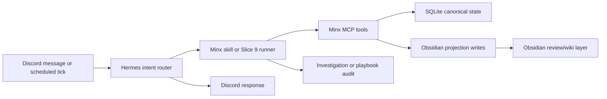

# Discord, Obsidian, And Hermes Flow Redesign

**Date:** 2026-04-30
**Status:** Designed
**Depends on:** Slice 8 playbooks, Slice 9 investigations, Minx render contract, current `minx-hermes` overlay

## Goal

Make Minx easier to use from Discord while keeping Hermes and Obsidian in their correct roles.

Discord should be the everyday control plane: quick capture, uploads, questions, nudges, and reports. Hermes should interpret the user intent, select the right Minx surface, enforce privacy and budget policy, and write user-facing prose. Minx MCP remains the canonical state and deterministic tool layer. Obsidian remains a projection and review layer, not the source of truth for finance, training, meals, goals, or memory decisions.

## Current Context

The live Hermes config already has dedicated Discord channels:

- `#finances`: finance uploads and finance import flow.
- `#health`: training, fitness, adherence, and goal questions.
- `#journal`: memory, goals, intake, and reflection.
- `#reports`: scheduled summaries, anomaly alerts, and links.
- `#meals`: meals, pantry, nutrition, recipes, and planning.

The live Hermes overlay now exposes four Slice 9 interactive skills:

- `/minx-investigate`: causal and exploratory questions.
- `/minx-plan`: planning across current goals, memory, finance, meals, and training.
- `/minx-retro`: period reviews and "what changed?" questions.
- `/minx-onboard-entity`: compact dossiers for people, merchants, places, habits, projects, and other known entities.

Minx MCP has durable read/write contracts for domain facts, investigations, playbooks, memory, goals, snapshots, and vault projection primitives. That means the redesign should mostly improve routing, prompts, confirmation policy, and docs rather than move business logic into Hermes.

## Options Considered

### Recommended: Hybrid Intent Router

Keep channel-specific defaults for obvious workflows, but route broad requests through the four Slice 9 surfaces. Automatic actions stay narrow: finance uploads in `#finances`, scheduled reviews in `#reports`, and clear read-only questions. Anything ambiguous goes through a short clarification or an explicit slash command.

Trade-off: slightly more routing rules to maintain, but it gives the best mix of speed, safety, and discoverability.

### Alternative: Slash Commands Only

Require explicit `/minx-*` commands for all cross-domain work. Channel prompts remain hints only.

Trade-off: safest and simplest to debug, but lower everyday usability. Minx feels less present because the user has to remember commands for common flows.

### Alternative: Fully Automatic Channel Agent

Let Hermes infer and execute the right flow from every Discord message.

Trade-off: smooth when it works, but too risky for personal data. It increases accidental writes, stale Obsidian projections, and hard-to-debug model decisions.

## Design

### Discord Flow

Discord gets three classes of behavior.

**1. Channel-native workflows**

These are allowed to trigger from normal messages when the intent is obvious:

- `#finances`: supported CSV/PDF attachments route to `minx/finance-import`. Hermes stages the attachment under the Minx import root, runs `finance_import_preview`, and imports only when account/source kind are clear. Ambiguity gets one concise clarification question.
- `#reports`: scheduled daily, weekly, memory, wiki, goal-nudge, and reconcile outputs. Responses stay concise and operational. Casual chat is discouraged here.
- `#journal`: stable preferences, routines, constraints, goals, and reflections route to memory/goal capture only when the user is asking to save or the fact is clearly durable. Sensitive or uncertain facts require confirmation.

**2. Intent-routed interactive workflows**

Hermes maps ordinary language to Slice 9 commands when the user asks a broad question:

- "why", "explain", "what happened", "what caused" -> `/minx-investigate`.
- "plan", "what should I do", "help me prepare" -> `/minx-plan`.
- "what changed", "review", "last week/month" -> `/minx-retro`.
- "tell me about", "what do we know about", "onboard" -> `/minx-onboard-entity`.

The command still runs the same production runner in `minx-hermes/scripts/minx-investigate.py`; Discord routing only chooses the surface and context.

**3. Confirmation-gated mutations**

Any mutation outside a channel-native workflow requires explicit confirmation. This includes memory confirmation/rejection, goal updates, vault writes, meal logs, training logs, pantry edits, finance categorization/rules, and persisted reports. Hermes should append an `investigation.needs_confirmation` step before stopping for the user's decision.

### Obsidian Flow

Obsidian is a projection/wiki layer. Minx writes into the vault only through Core vault tools, and only for clear projection surfaces:

- `Minx/Reviews/`: daily and weekly review notes.
- `Minx/Wiki/Entities/`: people, merchants, places, projects, and tools.
- `Minx/Wiki/Patterns/`: habits, recurring risks, recurring wins, constraints, and preferences.
- `Minx/Wiki/Goals/`: goal pages derived from active goal state and trajectory.
- `Minx/Reports/`: generated finance or cross-domain reports when a durable artifact is useful.

Rules:

- Canonical facts live in SQLite through Minx MCP, not in hand-authored notes.
- Generated wiki pages use `type: minx-wiki` and `wiki_type: entity|pattern|goal|review`.
- Memory notes use `type: minx-memory`; wiki/review pages do not.
- Existing user edits are preserved by section-level replacement when possible.
- Raw finance imports, raw Discord uploads, and raw LLM transcripts are not written to the vault.
- Obsidian MCP access is read-mostly for context; mutating writes should prefer Minx Core vault tools so secret scanning, frontmatter rules, and audit behavior stay consistent.

### Hermes Setup

Hermes uses the upstream `NousResearch/hermes-agent` checkout as the harness and `minx-hermes` as the Minx overlay. The overlay owns Minx-specific skills, runner scripts, smoke helpers, and cron snapshots.

Runtime expectations:

- `~/.hermes/skills/minx/*` symlinks point into `~/Documents/minx-hermes/skills/minx/*`.
- `skills.external_dirs` points at `~/Documents/minx-hermes/skills`.
- `mcp_servers` contains `minx_finance`, `minx_core`, `minx_meals`, `minx_training`, plus Obsidian/QMD when available.
- `provider_routing.data_collection` stays `deny` by default.
- The production runner sets OpenRouter provider preferences with `data_collection=deny`, `require_parameters=true`, `allow_fallbacks=true`, and `zdr=true`.
- Temporary free-model smoke tests must be opt-in through `MINX_INVESTIGATION_MODEL=openrouter/free` and `MINX_INVESTIGATION_DATA_COLLECTION=allow`, never the default for personal data.

### Data Flow

The flow is intentionally one-way for canonical data: Discord and Hermes request operations; Minx MCP validates and persists; Obsidian displays generated knowledge and selected review artifacts.

## Error Handling

- If a channel intent is ambiguous, Hermes asks one short clarification question instead of guessing.
- If Minx MCP is unavailable, Hermes reports that the Minx stack is down and does not simulate success.
- If a Slice 9 budget is exhausted, Hermes completes the investigation as `budget_exhausted` and returns a partial answer.
- If a playbook or investigation starts and then fails, Hermes must complete the audit row as `failed` before responding.
- If a vault write would overwrite user-authored content, Hermes should prefer section replacement or ask for confirmation.
- If a message contains secret-shaped data, memory/vault writes route through Core secret scanning and should block or redact before persistence.

## Testing And Verification

Implementation should be verified with:

- `hermes doctor` after any Hermes update or config migration.
- `~/Documents/minx-mcp/scripts/start_hermes_stack.sh` and `lsof` or MCP client smoke to confirm ports `8000-8003` are listening.
- `~/Documents/minx-hermes/scripts/smoke-investigations.sh --check-schema`.
- A deterministic investigation smoke using `scripts/minx-investigate-once.py --mode daily-snapshot`.
- `uv run pytest tests/ -x -q` in `minx-mcp`.
- `uv run --extra dev pytest tests/ -x -q` in `minx-hermes`.
- A Discord manual smoke for each channel class: finance upload preview/import, journal memory capture with confirmation, report delivery, one `/minx-investigate`, and one `/minx-plan`.

## Implementation Plan

1. Keep the readiness work: upstream Hermes current, config version current, live Minx skills symlinked into `~/Documents/minx-hermes`, and Minx stack smoke-tested.
2. Add a Hermes routing doc in `minx-hermes` that maps channel prompts and broad-language intents to the five channel classes and four Slice 9 surfaces.
3. Add a config validation script in `minx-hermes` that checks skill symlinks, `skills.external_dirs`, channel prompts, quick command aliases, MCP server URLs, and provider privacy defaults.
4. Tighten Discord channel prompts so they mention the Slice 9 routes and confirmation policy without turning every channel into an auto-agent.
5. Add smoke scripts or checklist commands for each Discord flow.
6. Add an Obsidian projection runbook that defines allowed vault paths, frontmatter types, and section-preserving write policy.

## Non-Goals

- No business logic in Hermes prompts.
- No raw Discord upload archival in Obsidian.
- No automatic mutation from broad investigation/planning runs.
- No direct edits to upstream `hermes-agent` for Minx-specific behavior unless an upstream bug blocks the overlay.
- No replacement of the existing Minx MCP render/template contract.
